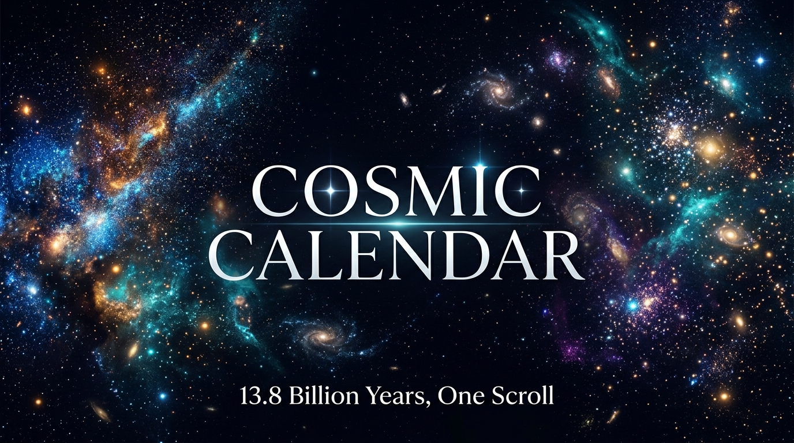

<div align="center">

# 🌌 Cosmic Calendar

**The entire history of the universe — 13.8 billion years — in a single, scroll-driven 3D experience.**

[](https://nextjs.org/)
[](https://threejs.org/)
[](https://www.typescriptlang.org/)
[](https://greensock.com/gsap/)
[](LICENSE)
[](https://cosmic-calendar-livid.vercel.app/)

[🚀 Live Demo](https://cosmic-calendar-livid.vercel.app/) · [Report Bug](https://github.com/Abhishekkrvr/Cosmic-Calendar/issues) · [Request Feature](https://github.com/Abhishekkrvr/Cosmic-Calendar/issues)

</div>

---

## ✨ About

**Cosmic Calendar** is an immersive, scroll-driven web experience inspired by Carl Sagan's famous *Cosmic Calendar* — a method of compressing the 13.8-billion-year history of the universe into a single year to make deep time feel visceral and real.

As you scroll, **2,600 particles** morph between 18 historically significant formations — from the Big Bang's primordial plasma to the rise of human civilization — each one rendered in real-time 3D on an interactive WebGL canvas.

> *"The cosmos is within us. We are made of star-stuff."*
> — Carl Sagan

---

## 🎬 Features

- **18 Cosmic Eras** — From the Big Bang to the present day, each era has a unique particle formation, color palette, and description
- **Real-Time 3D Particles** — 2,600 GPU-accelerated particles rendered with Three.js and React Three Fiber
- **Smooth Morphing** — GSAP-powered particle interpolation transitions between eras over 1.8 seconds
- **Orbital Mechanics** — The Solar System era features particles with simulated Keplerian orbital motion
- **Dynamic Camera Rig** — The camera subtly drifts and adjusts its distance based on the current era's shape
- **Background Starfield** — A persistent 700-star backdrop gives every scene a sense of infinite depth
- **Progress Navigation** — A sidebar dot-rail lets you jump directly to any era
- **Cosmic Calendar Dates** — Every event is shown both as a real age and as its equivalent date on Sagan's cosmic calendar
- **Fully Responsive** — Adaptive layout from mobile to widescreen

---

## 🌠 The 18 Eras

| # | Era | Years Ago | Cosmic Date |
|---|-----|-----------|-------------|
| 1 | Big Bang | 13.8 billion | Jan 1, 00:00 |
| 2 | First Stars | 13.5 billion | Jan 22 |
| 3 | Milky Way Forms | 13.2 billion | Mar 16 |
| 4 | Solar System | 4.6 billion | Sep 2 |
| 5 | Earth Forms | 4.5 billion | Sep 6 |
| 6 | Oceans | 4.1 billion | Sep 21 |
| 7 | First Life | 3.8 billion | Sep 30 |
| 8 | Cambrian Explosion | 541 million | Nov 18 |
| 9 | Land Plants | 470 million | Nov 27 |
| 10 | Dinosaurs | 230 million | Dec 13 |
| 11 | Chicxulub Impact | 66 million | Dec 26 |
| 12 | Mammals Rise | 55 million | Dec 26 |
| 13 | Homo Sapiens | 300,000 | Dec 31, 22:24 |
| 14 | Human Civilization | 12,000 | Dec 31, 23:59 |
| ... | *(and more)* | ... | ... |

---

## 🚀 Getting Started

### Prerequisites

- **Node.js** ≥ 18
- **npm** ≥ 9

### Installation

```bash
# Clone the repository
git clone https://github.com/Abhishekkrvr/Cosmic-Calendar.git
cd cosmic-calendar

# Install dependencies
npm install

# Start the development server
npm run dev
```

Open [http://localhost:3000](http://localhost:3000) in your browser.

### Build for Production

```bash
npm run build
npm run start
```

---

## 🏗️ Tech Stack

| Technology | Role |
|------------|------|
| [Next.js 14](https://nextjs.org/) | App framework (App Router) |
| [React Three Fiber](https://docs.pmnd.rs/react-three-fiber) | Declarative Three.js in React |
| [Three.js](https://threejs.org/) | WebGL 3D engine |
| [GSAP](https://greensock.com/gsap/) | Particle morph animation |
| [TypeScript](https://www.typescriptlang.org/) | Type safety |
| [Tailwind CSS](https://tailwindcss.com/) | UI styling |
| [Google Fonts](https://fonts.google.com/) | Sora + Inter typography |

---

## 📁 Project Structure

```
cosmic-calendar/
├── app/
│   ├── layout.tsx        # Root layout with fonts & metadata
│   ├── page.tsx          # Entry page
│   └── globals.css       # Global styles
├── components/
│   ├── Experience.tsx    # Scroll orchestration & UI overlay
│   └── Scene.tsx         # Three.js canvas, particles & camera
├── lib/
│   ├── timeline.ts       # The 18 cosmic eras & their metadata
│   └── particleShapes.ts # Shape generators for each era
└── public/
    └── banner.jpg        # Project banner
```

---

## 🎨 How It Works

### Particle Morphing

Each era pre-computes a `Float32Array` of 2,600 particle positions and colors at startup. When you scroll into a new era, GSAP tweens a blend factor `t` from 0 → 1. Every frame, positions and colors are linearly interpolated between the `from` and `to` shape arrays directly on the CPU and uploaded to the GPU as buffer attributes.

### Shape Generation

The `particleShapes.ts` library contains hand-crafted generators for each formation type:
- **explosion / plasma** — random spherical distributions with varying radii
- **starfield / galaxy** — spiral arms with logarithmic density falloff  
- **solarSystem** — concentric orbital rings with real Keplerian speed ratios
- **planet / ocean / land** — surface distributions on a sphere
- **human / civilization** — densely clustered small formations

### Camera Rig

The `CameraRig` component uses a per-era lookup table to set a target camera distance, then lerps the current distance toward it each frame. A slow sinusoidal drift (`sin(t × 0.08)`) gives the camera a gentle, breathing quality.

---

## 🤝 Contributing

Contributions are welcome! If you'd like to add a new era, improve a particle shape, or fix a bug:

1. Fork the repository
2. Create a feature branch: `git checkout -b feature/my-new-era`
3. Commit your changes: `git commit -m 'Add: Cambrian Explosion shape improvements'`
4. Push to the branch: `git push origin feature/my-new-era`
5. Open a Pull Request

---

## 📚 References & Inspiration

- Carl Sagan, *The Dragons of Eden* (1977)
- Carl Sagan, *Cosmos: A Personal Voyage* (1980)
- [Cosmic Calendar — Wikipedia](https://en.wikipedia.org/wiki/Cosmic_Calendar)
- [NASA Solar System Exploration](https://solarsystem.nasa.gov/)

---

## 📄 License

Distributed under the **MIT License**. See [`LICENSE`](LICENSE) for more information.

---

<div align="center">

Made with ☄️ and a sense of cosmic perspective

*You are reading this in the last second of the cosmic year.*

</div>
